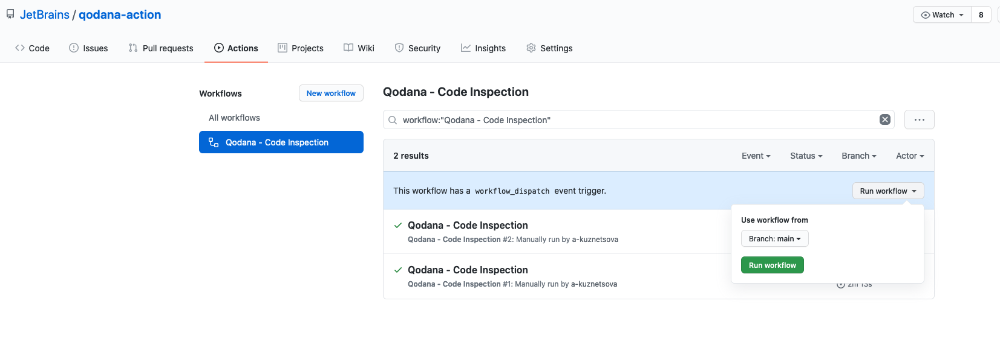
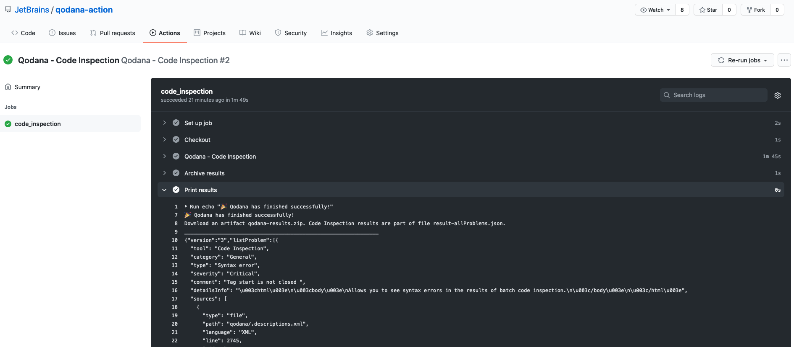
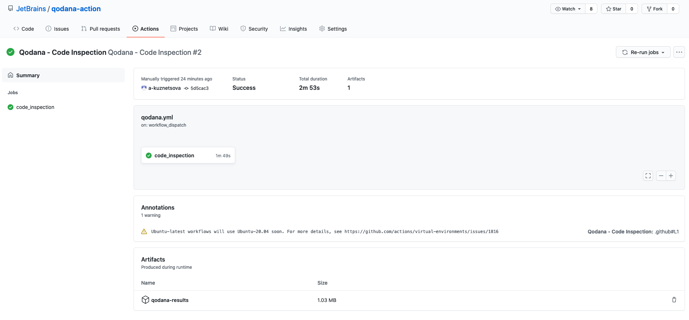

# Qodana Action

This repository contains simple example of Github Actions workflow integrated with [Qodana Docker image](https://hub.docker.com/r/jetbrains/qodana).

Pay attention to the page with [Supported Technologies](https://github.com/JetBrains/Qodana/blob/main/General/supported-technologies.md) before you begin.

### How to setup Actions

1. In your repository, create the `.github/workflows/` directory to store your workflow files.
2. Copy this [qodana.yml](.github/workflows/qodana.yml) file into the `.github/workflows/` directory.
3. Commit these changes and push them to your GitHub repository.
4. Under your repository name, click Actions.
5. Manually trigger workflow run, configure a workflow to run on specific branches or tags if needed.

6. Click on the job name to see the results of each step. Qodana results will be available in console.

7. Download ZIP artifacts.

